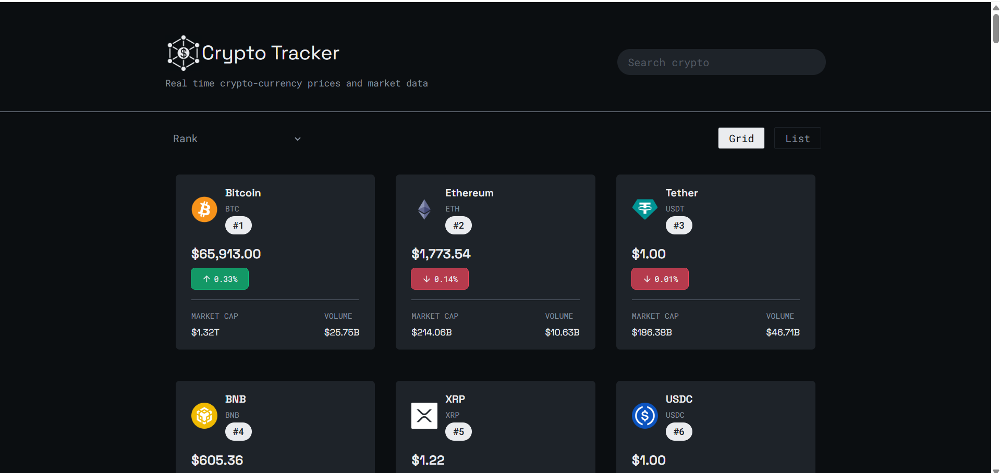

<h1>Crypto Currency Tracker</h1>

A React-based cryptocurrency tracking application that provides real-time market data, detailed cryptocurrency information, and interactive price charts.

The application allows users to explore the cryptocurrency market through search, sorting, detailed coin pages, and historical price visualizations, offering a clean and intuitive user experience.

Features:

- Real-time cryptocurrency market data
- Search and sort Cyrpto currencies
- Individual cryptocurrency detail pages
- Client-side routing with React Router
- Responsive and user-friendly interface

Tech Stack:

1. Frontend
- React
- Javascript(ES6+)
- HTML5
- Tailwind CSS

2. Libraries
- React router dom
- Tailwind
- Lucide react
- Recharts

3. API
- CoinGecko

Concepts Demonstrated:
- API integration using asynchronous JavaScript
- Client-side routing with React Router
- Dynamic data rendering
- Search and sorting algorithms
- Reusable React components
- State management with React Hooks
- Interactive data visualization using recharts
- Responsive web design

Screenshots:

Home Page:

 
Individual Crypto Page:

 
Crypto Sorting:

 

Future Improvements:
- Display prices in user preferred currency